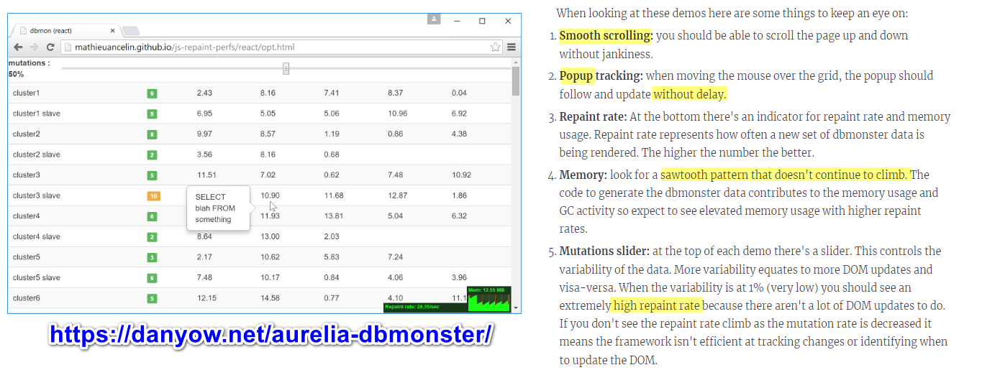
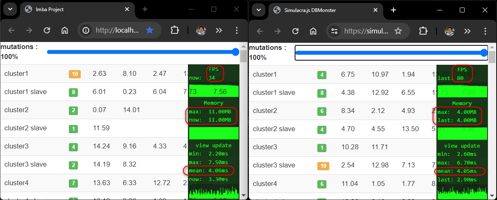

# imba-dbmonster
- result at https://imba-dbmonster.surge.sh/ using `surge dist` command
- result of all implementation https://github.com/mathieuancelin/js-repaint-perfs
- implement db-monster benchmark in imba. reference implementation on https://github.com/rich-harris/dom-monster demo on https://simulacra.js.org/dbmonster/
- original 2015 react talk repo https://github.com/ryanflorence/reactconf-2015-HYPE from https://blog.nparashuram.com/2015/03/performance-comparison-on-javascript.html
- 

## how do i
- [x] render row with 7 column
- [x] render table with many rows
- [x] make a tooltip when hover
- [x] show repaint speed and memory
- [ ] figure out how to import ENV.js using imba not html script (it's common js)
- [ ] generate random data (ENV.js) see demo from [hyperapp](https://github.com/mathieuancelin/js-repaint-perfs/blob/gh-pages/hyperapp/index.js)
- [ ] convert style.css and bootstrap.css to imba

## Result
- mean view update time 4ms, same as simulacra
- ram usage is higher, 11MB vs 4MB
- frame per second is lot lower (80 vs 34). Indicate that memoieze dom may not very performance when lots of change on each repaint (it 100 rows * 7 columns)
